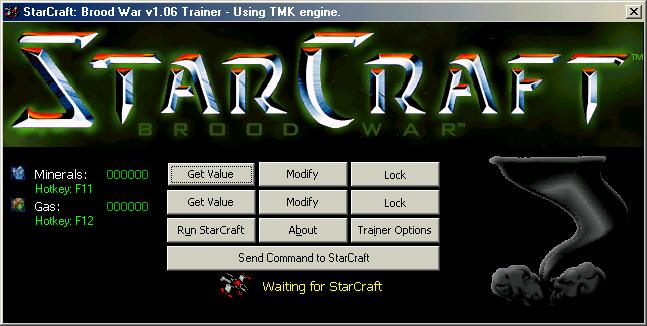



## Trainer Maker Kit with Anti\-Trainer Spy for Trainer protection

### Description

Helps you create your favorite game trainer by providing an easy to use functions like :

Read/Write memory, Send Keys to Game, Activate Window, Terminate Window, Terminate Trainer Spy *HOT*, and may more...
 
### More Info
 
This is the only trainer creation kit that supports Anti-TrainerSpy.

Please vote if you like it!

             |
---                |---
**Submitted On**   |2003-09-18 17:47:54
**By**             |[Black Tornado](https://github.com/Planet-Source-Code/PSCIndex/blob/master/ByAuthor/black-tornado.md)
**Level**          |Intermediate
**User Rating**    |4.7 (28 globes from 6 users)
**Compatibility**  |VB 4\.0 \(32\-bit\), VB 5\.0, VB 6\.0
**Category**       |[Complete Applications](https://github.com/Planet-Source-Code/PSCIndex/blob/master/ByCategory/complete-applications__1-27.md)
**World**          |[Visual Basic](https://github.com/Planet-Source-Code/PSCIndex/blob/master/ByWorld/visual-basic.md)
**Archive File**   |[Trainer\_Ma1647199182003\.zip](https://github.com/Planet-Source-Code/black-tornado-trainer-maker-kit-with-anti-trainer-spy-for-trainer-protection__1-48617/archive/master.zip)

